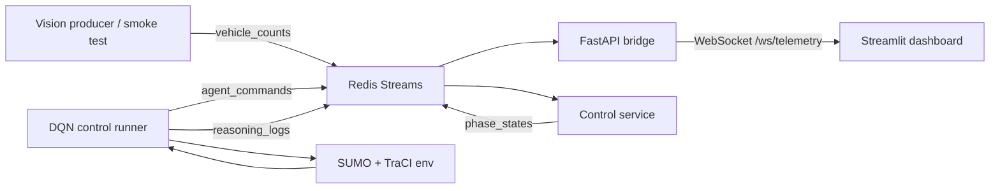

# Smart Traffic System

A real-time smart traffic light control system that combines SUMO simulation, a trained DQN agent, Redis Streams, FastAPI WebSockets, YOLO-based traffic telemetry, a safety control service, and a Streamlit dashboard.

The project is organized as a merged system from two development tracks:

- **Vision, streaming, API, dashboard:** camera/video processing, Redis events, WebSocket fan-out, and live UI.
- **SUMO, RL, control logic:** 80-cell state encoding, DQN checkpoint loading, phase decisions, reward/benchmarking, and safe phase transitions.

## Current System Flow



## Key Features

- SUMO 4-way intersection simulation with TraCI.
- 80-cell grid state encoder for reinforcement learning.
- DQN architecture using the current two-phase action space:
  - `EAST_WEST`
  - `NORTH_SOUTH`
- Real checkpoint runtime via `rl.control_runner`.
- Redis Streams contracts:
  - `vehicle_counts`
  - `agent_commands`
  - `phase_states`
  - `reasoning_logs`
- FastAPI WebSocket bridge for live telemetry.
- Streamlit dashboard showing lane counts, active phase, and AI Q-values.
- Safety FSM with yellow/all-red buffers and watchdog fallback.
- YOLO vision smoke test container wired to Redis.

## Repository Layout

```text
api/                    FastAPI app and WebSocket routes
benchmark/              Fixed-time vs DQN evaluation tools
common/                 Shared constants, config, schemas, logging
control/                Safety FSM and Redis command consumer
dashboard/              Streamlit live dashboard
docker/                 Service Dockerfiles
rl/                     DQN agent, SUMO env, training, live control runner
simulation/             SUMO network, TraCI wrapper, state encoder
streaming/              Redis bus and WebSocket broadcaster
tests/                  Unit and integration tests
vision/                 YOLO detection, ROI counting, video producers
checkpoints/            Local trained model checkpoints
```

## Requirements

- Python 3.11+
- `uv`
- Docker Desktop for Redis and vision container smoke tests
- SUMO installed locally for `traci` runtime
- A trained checkpoint in `checkpoints/`

The default live checkpoint is:

```text
checkpoints/dqn_ew_repair_best.pt
```

## Quick Start

Install dependencies:

```bash
uv sync
```

Start Redis:

```bash
docker compose up -d redis
```

Open four terminals from the repository root.

Terminal 1, API:

```bash
uv run python -m uvicorn api.main:app --reload
```

Terminal 2, control service:

```bash
uv run python -m control.service
```

Terminal 3, dashboard:

```bash
uv run streamlit run dashboard/app.py
```

Terminal 4, trained DQN agent:

```bash
uv run python -m rl.control_runner \
  --checkpoint checkpoints/dqn_ew_repair_best.pt \
  --sumocfg simulation/net/intersection.sumocfg \
  --episode-duration 300 \
  --backend traci
```

On Windows PowerShell, use backticks or carets for line continuation, or put the command on one line.

## Fast Smoke Test

To verify the model-to-control integration quickly:

```bash
uv run python -m rl.control_runner \
  --checkpoint checkpoints/dqn_ew_repair_best.pt \
  --sumocfg simulation/net/intersection.sumocfg \
  --episode-duration 60 \
  --backend traci \
  --decision-interval 0
```

`--decision-interval 0` runs as fast as SUMO allows. For live dashboard demos, keep the default interval so the safety FSM can visibly process transitions.

## Vision Docker Smoke Test

Build and run the vision service:

```bash
docker compose build vision
docker compose up -d vision
```

The current vision container runs `vision.producer.smoke_test`, publishes events to Redis for a short run, then exits with code `0` when complete.

Check Redis stream length:

```bash
docker exec smart-traffic-system-redis-1 redis-cli XLEN vehicle_counts
```

## Benchmarking

Run fixed-time vs trained DQN evaluation:

```bash
uv run python -m benchmark.compare \
  --checkpoint checkpoints/dqn_ew_repair_best.pt \
  --sumocfg simulation/net/intersection.sumocfg \
  --episode-duration 300 \
  --seeds 1 2 3 \
  --backend traci
```

Reports are written under `benchmark/results/`.

## Tests

Run core contract and DQN tests:

```bash
uv run python -m pytest tests/test_control_contract.py tests/test_dqn.py -q
```

Run the full test suite:

```bash
uv run pytest -q
```

Some integration tests require SUMO and will skip cleanly if SUMO is unavailable.

## Notes

- The canonical runtime action contract is now `target_phase`, not a single `target_direction`.
- Legacy `target_direction` commands are still accepted and mapped to the corresponding two-way phase.
- Docker Compose currently starts Redis and the vision smoke service. API, control, dashboard, and the DQN runner are run locally with `uv` for the integrated live workflow.
- The dashboard receives telemetry through the FastAPI WebSocket bridge at `ws://localhost:8000/ws/telemetry`.

