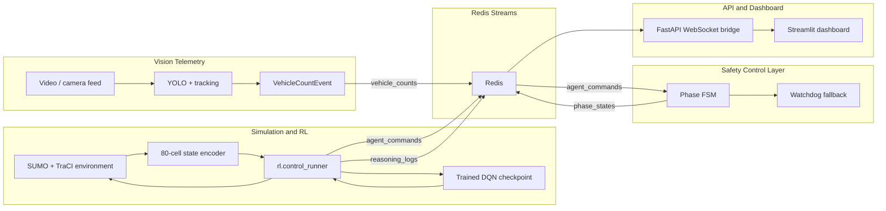

# Smart Traffic System

An integrated traffic-light intelligence platform that combines **computer vision**, **real-time event streaming**, **SUMO traffic simulation**, and a **trained Deep Q-Network (DQN)** to make adaptive signal-control decisions.

This repository is built as a production-style monorepo: separate services communicate through Redis Streams, shared contracts live in `common/`, and the trained reinforcement-learning policy is wired into the same control path used by the live dashboard and safety executor.

## The Real-World Problem

Most urban intersections still run on fixed-time traffic-light programs. They are simple and predictable, but they do not react well to reality:

- traffic demand changes by time of day
- one road can become overloaded while another remains nearly empty
- emergency slowdowns, short bursts, and asymmetric queues are common
- reducing one queue can accidentally starve another direction
- a traffic-control decision is safety-critical, so the system cannot simply switch lights instantly

The interesting engineering challenge is not only "train a model." It is building a system where a model can make decisions while the rest of the platform keeps the intersection observable, debuggable, and safe.

## How This System Solves It

The project models a four-way intersection in SUMO and converts the live traffic state into an **80-cell occupancy vector**. A trained DQN consumes that state and selects one of two realistic two-way traffic phases:

- `EAST_WEST`
- `NORTH_SOUTH`

Those decisions do not directly mutate the signal state. They are published as Redis events, consumed by a dedicated control service, then passed through a finite-state safety machine that enforces:

- no-op behavior when the phase is unchanged
- yellow transition before losing a green phase
- all-red safety buffer before granting the next green
- watchdog fallback to all-red if the agent stops sending commands

The dashboard receives the same event stream as the backend, so it can show the active phase, lane telemetry, and the agent's Q-values in real time.

## System Architecture



## What Makes It Interesting

This project goes beyond a notebook demo. The trained policy is connected to an actual runtime system:

- **Model-to-service integration:** `rl.control_runner` loads a real checkpoint and publishes live decisions to Redis.
- **Shared contracts:** Pydantic schemas define the boundary between RL, control, API, dashboard, and vision.
- **Safety-aware execution:** the control service owns yellow/all-red transitions instead of letting the model directly flip lights.
- **Real-time observability:** FastAPI bridges Redis Streams into WebSocket messages for the dashboard.
- **Two-track merge resolved:** the project integrates the vision/backend track and the SUMO/RL/control track into one coherent event flow.
- **Benchmark harness:** fixed-time and DQN policies can be compared under identical SUMO demand.

## Runtime Event Contracts

| Stream | Producer | Consumer | Purpose |
| --- | --- | --- | --- |
| `vehicle_counts` | Vision producer | API, dashboard | Lane/count telemetry from video or smoke test |
| `agent_commands` | DQN runner | Control service | Model-selected target phase |
| `phase_states` | Control service | API, dashboard | Physical/safety phase state |
| `reasoning_logs` | DQN runner | API, dashboard | Q-values, chosen action, simulation time |

The canonical action contract is `target_phase`. Legacy `target_direction` payloads are still accepted and mapped to the matching two-way phase for compatibility.

## Current Capabilities

- SUMO four-way intersection with deterministic TraCI sessions.
- 80-cell state encoder for DQN observations.
- DQN model architecture with 5 hidden layers of 400 units.
- Real checkpoint loading from `checkpoints/`.
- Live DQN control runner publishing decisions to Redis.
- Safety FSM consuming model decisions and publishing phase state.
- FastAPI WebSocket telemetry bridge.
- Streamlit dashboard for active phase, lane counts, and Q-values.
- YOLO vision smoke-test container publishing `VehicleCountEvent` records.
- Fixed-time vs DQN benchmark tooling.

## Repository Layout

```text
api/                    FastAPI app and WebSocket routes
benchmark/              Fixed-time vs DQN evaluation tools
common/                 Shared constants, config, schemas, logging
control/                Safety FSM and Redis command consumer
dashboard/              Streamlit live dashboard
docker/                 Service Dockerfiles
rl/                     DQN agent, SUMO env, training, live control runner
simulation/             SUMO network, TraCI wrapper, state encoder
streaming/              Redis bus and WebSocket broadcaster
tests/                  Unit and integration tests
vision/                 YOLO detection, ROI counting, video producers
checkpoints/            Local trained model checkpoints
```

## Requirements

- Docker Desktop
- A trained checkpoint in `checkpoints/`
- Python 3.11+, `uv`, and local SUMO only if you want to run services outside Docker

Recommended checkpoint:

```text
checkpoints/dqn_ew_repair_best.pt
```

## Quick Start

Start the full Docker stack:

```bash
docker compose up --build
```

This starts:

- Redis
- FastAPI telemetry bridge
- control service
- Streamlit dashboard
- trained DQN agent runner
- vision smoke producer

Open the dashboard:

```text
http://localhost:8502
```

Open the API health check:

```text
http://localhost:8000/health
```

Stop the stack:

```bash
docker compose down
```

The Docker stack publishes Redis on host port `6380` and the dashboard on host port `8502` to avoid clashing with local Redis/Streamlit sessions. Override host ports when needed:

```bash
REDIS_HOST_PORT=6380 API_HOST_PORT=8001 DASHBOARD_HOST_PORT=8503 docker compose up --build
```

## Local Development Run

Use this mode when you want faster iteration with local Python tools.

Install dependencies:

```bash
uv sync
```

Start Redis:

```bash
docker compose up -d redis
```

Open four terminals from the repository root.

### Terminal 1: API Gateway

```bash
uv run python -m uvicorn api.main:app --reload
```

### Terminal 2: Control Service

```bash
uv run python -m control.service
```

### Terminal 3: Dashboard

```bash
uv run streamlit run dashboard/app.py
```

Open:

```text
http://localhost:8501
```

### Terminal 4: Trained DQN Runtime

```bash
uv run python -m rl.control_runner \
  --checkpoint checkpoints/dqn_ew_repair_best.pt \
  --sumocfg simulation/net/intersection.sumocfg \
  --episode-duration 300 \
  --backend traci
```

PowerShell one-line version:

```powershell
uv run python -m rl.control_runner --checkpoint checkpoints/dqn_ew_repair_best.pt --sumocfg simulation/net/intersection.sumocfg --episode-duration 300 --backend traci
```

When this local runner should publish into the Docker dashboard stack, point it at the Docker Redis host port:

```powershell
$env:REDIS_HOST = "127.0.0.1"; $env:REDIS_PORT = "6380"
.\.venv\Scripts\python.exe -m rl.control_runner --checkpoint checkpoints/dqn_ew_repair_best.pt --sumocfg simulation/net/intersection.sumocfg --episode-duration 300 --backend traci --gui --decision-interval 1
```

## Fast Integration Smoke Test

Use this to prove the model-control-dashboard event flow quickly:

```bash
uv run python -m rl.control_runner \
  --checkpoint checkpoints/dqn_ew_repair_best.pt \
  --sumocfg simulation/net/intersection.sumocfg \
  --episode-duration 60 \
  --backend traci \
  --decision-interval 0
```

`--decision-interval 0` runs as fast as SUMO allows. For a live dashboard demo, keep the default interval so the safety FSM has time to show visible transitions.

## Vision Docker Smoke Test

Run only Redis and the vision smoke service:

```bash
docker compose up --build redis vision
```

The current container runs `vision.producer.smoke_test`, publishes events into Redis, then exits successfully.

Check the stream:

```bash
docker exec smart-traffic-system-redis-1 redis-cli XLEN vehicle_counts
```

## Benchmarking

Run fixed-time vs trained DQN evaluation:

```bash
uv run python -m benchmark.compare \
  --checkpoint checkpoints/dqn_ew_repair_best.pt \
  --sumocfg simulation/net/intersection.sumocfg \
  --episode-duration 300 \
  --seeds 1 2 3 \
  --backend traci
```

Benchmark reports are written under:

```text
benchmark/results/
```

## Verification

Core tests:

```bash
uv run python -m pytest tests/test_control_contract.py tests/test_dqn.py -q
```

Full test suite:

```bash
uv run pytest -q
```

Some integration tests require SUMO and skip cleanly when SUMO is unavailable.

## Development Notes

- `common/constants.py` is the single source of truth for action space and safety timing.
- `common/schemas/control.py` is the runtime treaty between the model, control service, API, and dashboard.
- `rl/control_runner.py` is the integration bridge between the trained model and the live event bus.
- `control/service.py` should remain the only service that owns physical phase transitions.
- `dashboard/` should display events, not compute control decisions.

## Current Limitations

- The vision service is currently a smoke-test container, not a long-running multi-camera deployment.
- The dashboard is Streamlit v1; a richer React dashboard is a natural next step.
- The model controls a SUMO simulation loop; physical hardware integration would require an adapter beneath `control/`.

## Why This Project Matters

This project demonstrates the kind of engineering required to move an ML idea toward a real system:

- translating raw environment state into a stable model input
- keeping model inference separate from safety execution
- using message streams instead of direct process coupling
- exposing model reasoning for observability
- validating integration with tests and runtime smoke checks

It is intentionally shaped like a production system, not a single-script experiment.
