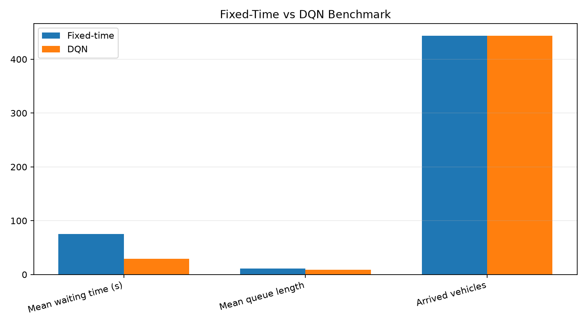
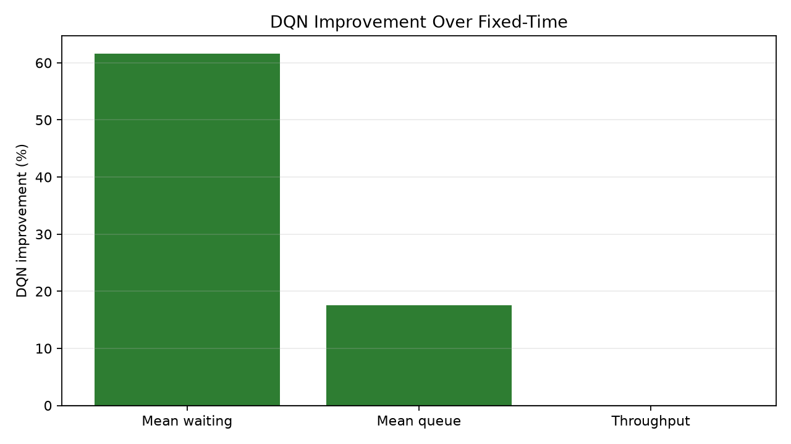

# Benchmark Report

- Checkpoint: `checkpoints/dqn_eval_best.pt`
- SUMO config: `simulation/net/intersection.sumocfg`
- Episode duration: `1200.0` seconds
- Seeds: `1, 2, 3, 4, 5, 6, 7, 8, 9, 10`
- Source generated at: `2026-07-27T01:22:21.975391+00:00`

## Headline

The trained DQN is compared against the fixed-time baseline using the same two-phase action space and the same yellow/all-red safety buffers.

## Metrics

| Metric | Fixed-time | DQN | DQN improvement |
| --- | ---: | ---: | ---: |
| Mean waiting time (s) | 75.29 | 28.88 | 61.6% |
| Final waiting time (s) | 0.00 | 0.00 | 0.0% |
| Mean queue length | 11.02 | 9.08 | 17.6% |
| Arrived vehicles | 444.00 | 444.00 | 0.0% |

## Charts

